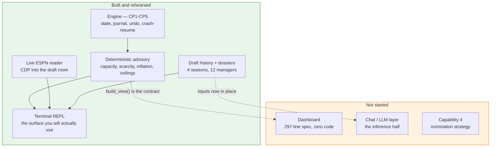

# Build status

**As of 2026-08-18. Draft day is 2026-08-31 — 13 days out.**

Read this first. [`HANDOFF.md`](HANDOFF.md) is the running record of *how* things
came to be the way they are, and it has grown to 645 lines; this is the
stage-by-stage picture of *where they stand*.

> **You can draft today.** Every checkpoint is complete, all v1 capabilities
> ship, and the whole path was rehearsed against a live ESPN practice draft on
> 2026-08-17. Everything listed as not started is an improvement, not a
> prerequisite.

892 tests · 74 source modules · 36 test modules.

---

## The shape of it



---

## Engine checkpoints — all complete

| | Scope | Status |
|---|---|---|
| **CP1** | Scaffold, config layer, ESPN probe | ✅ |
| **CP2** | State engine, event journal, REPL, undo, crash-resume, view-model contract | ✅ |
| **CP3** | Reference-data loader + deterministic advisory layer | ✅ |
| **CP4** | Auction simulator with budget-aware bots | ✅ |
| **CP5** | Live ESPN draft-room reader, `config init`, `data fetch` | ✅ |

**There is no CP6.** Everything below is product work.

---

## The 12 advisory capabilities

### v1 — the nominate → forecast → bid → win/lose loop

| # | Capability | Status | Where |
|---|---|---|---|
| 1 | Opponent snapshot | ✅ | `advice/bidding.py::threats_for` |
| 2 | Bid forecasting | 🟡 **half** | capacity ships; **intent needs the LLM layer** |
| 3 | Our bid recommendation | ✅ | `guidance_for`, incl. `safe_legal_bid` |
| 5 | Overspend alerts | ✅ | `advice/market.py::value_alert` |
| 7 | Owner dossiers | ✅ | `dossier/` — and **100% filled** |
| 10 | Positional scarcity | ✅ | `advice/scarcity.py` |
| — | Market inflation | ✅ | `advice/market.py::market_state` |

Capability 2 is the only partial one, and the split is deliberate: **capacity is
arithmetic and is finished; intent is inference and is not.**

### v1.1 — none started

| # | Capability | Note |
|---|---|---|
| 4 | Nomination strategy | **Unblocked and cheap.** `draftSettings.pickOrder` gives the whole nomination order *before the draft starts*, and nothing reads it. |
| 6 | Ambient feed | Needs a surface that is allowed to interrupt. |
| 8 | Post-pick fit | `starter_gaps` / `open_slots_by_pos` already compute the inputs. |
| 9 | Danger-zone watchlist | |
| 12 | Strategy adherence | Also needs **C2**, the strategy preset. |

### v2 — not started

| # | Capability | Note |
|---|---|---|
| 11 | Post-draft grade | Fires after the final pick, so zero draft-day risk. Build whenever. |

---

## The three surfaces

| Surface | Status |
|---|---|
| **Terminal REPL** | ✅ Complete. Rehearsed live 2026-08-17; full 180-pick dry run 2026-08-18. |
| **Dashboard** | ❌ **Not started.** `docs/dashboard_requirements.md` is a 297-line panel-by-panel spec with no implementation. `build_view()` already emits every key it asks for, including the new `history` block. |
| **Chat / LLM layer** | ❌ **Not started.** Every input is now in place: dossiers filled, history measured, `build_view()` as the contract. Keep it **beside** the hot path — `advice` is instant and cannot fail, and a network call in that loop would add latency and a failure mode while a clock runs. |

---

## Blocking items

| | Item | Status |
|---|---|---|
| A1 | Auction values | ✅ `ffa data fetch` — 355 players from ESPN |
| A4 | ESPN cookies | ✅ |
| A5 | Prior-season capture | ✅ |
| B1 | Does ESPN populate prices? Is there a real-time channel? | ✅ **Both halves answered.** Prices yes; the draft room is SSE and REST stays empty during a draft — hence the CDP reader. |
| C1 | Owner dossiers | ✅ **100% covered** — 5 fields derived, 11 managers interviewed |
| C2 | Draft strategy preset | ❌ Not started (was always v1.1) |
| Debt 1–7 | | ✅ All closed |

---

## Built this session, outside the original plan

| | |
|---|---|
| **Draft history** | 4 usable seasons (2022–25), 720 priced picks, full nomination order |
| **Evidence harness** | Every claim permutation-tested; **5 of 9 dropped as noise** |
| **Manager aliases** | Brian Cona's two ESPN accounts merged; orphan discovery built in |
| **Pace vs precedent** | Live in the bid readout, bounded to where the record discriminates |

---

## What is actually left

**One thing on the critical path:**

> **A second live rehearsal.** Everything shipped since 2026-08-17 — the raw
> console, the multi-tab guard, the stale-board guard, `safe_legal_bid`, the
> pace readout — is unit-tested and dry-run, but has never touched real ESPN
> traffic.
>
> ```
> python tools/draft_room_probe.py --launch
> ffa draft --new --source espn
> ```
>
> Start an ESPN practice draft, buy three or four players. Half an hour, and it
> is the only thing between "tested" and "proven".

**One cheap win:** capability 4. The nomination order is knowable in advance and
nothing uses it.

**Two large optional builds:** the dashboard and the LLM layer. Both fully
unblocked. Neither is needed on 2026-08-31.

---

## Draft-day command sequence

```
python tools/draft_room_probe.py --launch   # one-time: Chrome with a debug port
ffa config init                             # rebuild league.toml from ESPN
ffa config nicknames                        # names you can type under a clock
ffa config alias                            # check for second accounts
ffa data fetch                              # ESPN's consensus auction values
ffa history fetch && ffa history report     # prior seasons -> precedent artifact
ffa dossier status                          # confirm coverage
ffa config check                            # last gate before the day
ffa draft --new --source espn               # draft
```
