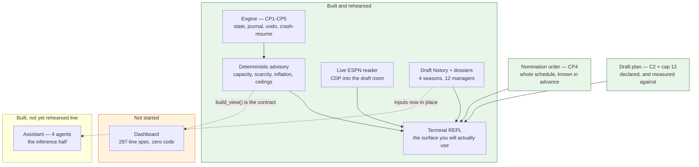

# Build status

**As of 2026-08-18. Draft day is 2026-08-31 — 13 days out.**

Read this first. [`HANDOFF.md`](HANDOFF.md) is the running record of *how* things
came to be the way they are; this is the stage-by-stage picture of *where they
stand*.

> **Want it as a page rather than a document?** [`status.html`](status.html) is
> the same picture, rendered — open it in a browser and refresh it. It is
> generated from [`status.json`](status.json), which is the structured half of
> this file:
>
> ```
> python tools/status_page.py          # regenerate after a phase lands
> python tools/status_page.py --check  # fail if it is out of date
> ```
>
> Update `status.json`, re-run the generator, and the page, the counts and the
> countdown all move together. The volatile numbers — tests, modules, lines,
> commits, days to draft — are **derived from the repo at render time** rather
> than typed in, because those are exactly the ones that go stale in a
> hand-maintained status doc.

> **You can draft today.** Every checkpoint is complete, all v1 capabilities
> ship, and the whole path was rehearsed against a live ESPN practice draft on
> 2026-08-17. Everything listed as not started is an improvement, not a
> prerequisite.

968 tests · 78 source modules · 38 test modules.

---

## The shape of it



---

## Engine checkpoints — all complete

| | Scope | Status |
|---|---|---|
| **CP1** | Scaffold, config layer, ESPN probe | ✅ |
| **CP2** | State engine, event journal, REPL, undo, crash-resume, view-model contract | ✅ |
| **CP3** | Reference-data loader + deterministic advisory layer | ✅ |
| **CP4** | Auction simulator with budget-aware bots | ✅ |
| **CP5** | Live ESPN draft-room reader, `config init`, `data fetch` | ✅ |

**There is no CP6.** Everything below is product work.

---

## The 12 advisory capabilities

### v1 — the nominate → forecast → bid → win/lose loop

| # | Capability | Status | Where |
|---|---|---|---|
| 1 | Opponent snapshot | ✅ | `advice/bidding.py::threats_for` |
| 2 | Bid forecasting | ✅ | capacity is arithmetic; intent is the Room — built, guarded, not yet rehearsed live |
| 3 | Our bid recommendation | ✅ | `guidance_for`, incl. `safe_legal_bid` |
| 5 | Overspend alerts | ✅ | `advice/market.py::value_alert` |
| 7 | Owner dossiers | ✅ | `dossier/` — and **100% filled** |
| 4 | Nomination strategy | ✅ **new** | `advice/nomination.py` — schedule exact; candidate lists thin by design |
| 10 | Positional scarcity | ✅ | `advice/scarcity.py` |
| 12 | Strategy adherence | ✅ **new** | `advice/strategy.py` — needs a plan declared |
| — | Market inflation | ✅ | `advice/market.py::market_state` |

Capability 2 was the only partial one and the split is still the design:
**capacity is arithmetic; intent is inference.** Both halves now ship, and they
stay in separate packages with an import boundary a test enforces — nothing in
`advice/`, `domain/` or `state/` may import `assist/`. What has not happened yet
is a live rehearsal of the inference half.

### v1.1 — two shipped early

| # | Capability | Note |
|---|---|---|
| 6 | Ambient feed | Needs a surface that is allowed to interrupt. |
| 8 | Post-pick fit | `starter_gaps` / `open_slots_by_pos` already compute the inputs. |
| 9 | Danger-zone watchlist | |

### v2 — not started

| # | Capability | Note |
|---|---|---|
| 11 | Post-draft grade | Fires after the final pick, so zero draft-day risk. Build whenever. |

---

## The three surfaces

| Surface | Status |
|---|---|
| **Terminal REPL** | ✅ Complete. Rehearsed live 2026-08-17; full 180-pick dry runs 2026-08-18, incl. the new `turns` readout. |
| **Dashboard** | ❌ **Not started.** `docs/dashboard_requirements.md` is a 297-line panel-by-panel spec with no implementation. `build_view()` already emits every key it asks for, including the new `history` block. |
| **Assistant (chat / LLM)** | ✅ **Built, not yet rehearsed live.** Four agents over one cached prefix and one shared memory — see [`docs/agents.md`](agents.md). It sits **beside** the hot path, never inside it: the deterministic readout prints first and nothing here can delay it. Off unless you pass `--assist`. Remaining: a live run for real latency, a real cache hit rate on the second model tier, and a real invoice. |

---

## Blocking items

| | Item | Status |
|---|---|---|
| A1 | Auction values | ✅ `ffa data fetch` — 355 players from ESPN |
| A4 | ESPN cookies | ✅ |
| A5 | Prior-season capture | ✅ |
| B1 | Does ESPN populate prices? Is there a real-time channel? | ✅ **Both halves answered.** Prices yes; the draft room is SSE and REST stays empty during a draft — hence the CDP reader. |
| C1 | Owner dossiers | ✅ **100% covered** — 5 fields derived, 11 managers interviewed |
| C2 | Draft strategy preset | ✅ **DONE 2026-08-18.** `ffa strategy init` builds one from the market; `[strategy]` in `league.toml`; capability 12 measures against it. Still the thing standing between capability 4's two candidate lists and a real "nominate this next". |
| Debt 1–7 | | ✅ All closed |

---

## Built this session, outside the original plan

| | |
|---|---|
| **Draft history** | 4 usable seasons (2022–25), 720 priced picks, full nomination order |
| **Evidence harness** | Every claim permutation-tested; **5 of 9 dropped as noise** |
| **Manager aliases** | Brian Cona's two ESPN accounts merged; orphan discovery built in |
| **Pace vs precedent** | Live in the bid readout, bounded to where the record discriminates |
| **Nomination order** | Capability 4. `pickOrder` read, cycle verified against a real 180-pick auction, `turns` readout, `nomination_plan` in `build_view()` |
| **Draft plan** | C2 + capability 12. Market-derived default allocation, `plan` readout, `strategy` in `build_view()`, plan cap carried into the bid readout without ever applying it |

---

## What is actually left

**Nothing.** The second live rehearsal ran on 2026-08-18 — see below.

**What the rehearsal settled, and what it did not:**

> **Confirmed live:** the stale-board guard (`the board already shows 6 pick(s)
> of 180`), attach and 12/12 team matching, the pace readout against four
> seasons, live bid guidance through ~320 picks, and **capability 4** — `ffa
> config init --force` read the real nomination order off ESPN and `config
> check` printed it back as names.
>
> **Two bugs found, both fixed:** a source that gave up left the main loop
> parked on the queue forever, and Ctrl-C exited on a traceback. Both are
> draft-day paths and both now have tests.
>
> **Not exercised:** `safe_legal_bid`'s optimistic-ceiling path never fired —
> no pick arrived without a price, so `legal max` never showed its `+`.
>
> **Still unobserved:** what `--selecting` means while bidding runs.

**One command still outstanding.** `ffa config init --force` has been run, so
the nomination order is on file. The *plan* is not: C2 landed after that
rebuild, so `[strategy]` is still empty and `plan` has nothing to measure.

```
ffa strategy init      # needs `ffa data fetch` to have run; it has
ffa config check       # prints the plan back, and says when there is none
```

**One large optional build left:** the dashboard. Fully unblocked, and not
needed on 2026-08-31.

**The assistant is built and unrehearsed.** Every agent is unit-tested against a
fake `complete` callable, and the invariant that matters — a draft run with
`--assist` and one without produce a byte-identical `events.jsonl` — is pinned by
test. What no test can produce is real latency, a real cache hit rate across two
model tiers, or a real bill. `ffa sim --assist` is the acceptance test, and it
should run before the assistant is trusted on draft day.

**One question the next rehearsal can still answer for free.** The draft room marks a seat
`--selecting`, and `RoomTeam.is_nominating` already parses it, but what it means
*while bidding runs* — the seat that put this player up, or the seat due to put
up the next one — has never been observed. It is deliberately not wired to
`nominated_by` until it is: guessing wrong would make the stale-order banner
fire on nearly every pick. `tools/draft_watch.py` already flashes it on change,
so watching one nomination land settles it.

---

## Draft-day command sequence

```
python tools/draft_room_probe.py --launch   # one-time: Chrome with a debug port
ffa config init                             # rebuild league.toml from ESPN
ffa config nicknames                        # names you can type under a clock
ffa config alias                            # check for second accounts
ffa data fetch                              # ESPN's consensus auction values
ffa history fetch && ffa history report     # prior seasons -> precedent artifact
ffa dossier status                          # confirm coverage
ffa strategy init                           # a plan off the market, for you to edit
ffa strategy show                           # the plan, and adherence to it
ffa config check                            # last gate before the day
ffa draft --new --source espn               # draft
```

`ffa config init` is what puts the nomination order in place; `ffa config check`
prints it back as names you recognise, and says so plainly if it is missing. It
prints the plan the same way, and says when there is none.

**`ffa strategy init` needs `ffa data fetch` to have run** — the default
allocation is read off the reference sheet rather than asserted, so there has to
be a sheet.
